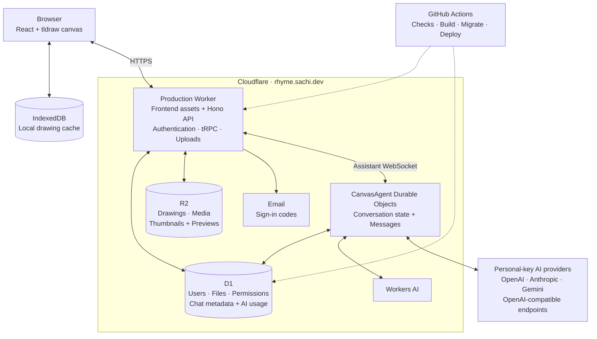

# Rhyme

A personal whiteboard project for sketches, diagrams, and ideas, with an AI assistant that can edit the canvas.

Built with tldraw, React, TanStack Start, and Cloudflare Workers, D1, and R2.

## Infrastructure



Drawings persist locally, then sync to R2 with version checks in D1. Assistant conversations run in Durable Objects; their tool calls return through the Worker to the browser, where edits enter the same save flow.

## Run locally

Requires Node.js 22+ and pnpm 11.25.0.

1. Run `pnpm install --frozen-lockfile`.
2. Copy `apps/api/.dev.vars.example` to `apps/api/.dev.vars` and set `BETTER_AUTH_SECRET` (at least 32 characters).
3. Copy `apps/web/.env.example` to `apps/web/.env`.
4. Run `pnpm --filter api exec wrangler login`, then `pnpm db:migrate` and `pnpm dev`.
5. Open [localhost:3000](http://localhost:3000).

Sign-in codes appear in the API console. Workers AI uses your Cloudflare account even locally.

## Google and GitHub sign-in

Set `GOOGLE_CLIENT_ID`, `GOOGLE_CLIENT_SECRET`, `GITHUB_CLIENT_ID`, and `GITHUB_CLIENT_SECRET` in `apps/api/.dev.vars` for local development. Each provider is enabled when both of its credentials are set. Email sign-in works without these credentials.

Create a Google OAuth client with application type **Web application**, and a GitHub **OAuth App**. Register these callback URLs:

| Provider | Local callback                               | Production callback                            |
| -------- | -------------------------------------------- | ---------------------------------------------- |
| Google   | `http://localhost:8787/auth/callback/google` | `https://rhyme.sachi.dev/auth/callback/google` |
| GitHub   | `http://localhost:8787/auth/callback/github` | `https://rhyme.sachi.dev/auth/callback/github` |

Use separate GitHub OAuth Apps for local and production callbacks. Google can register both callback URLs on one client. Successful sign-ins finish onboarding and import guest drawings through `/auth/complete`.

For production, store all four values as Cloudflare Worker secrets. Run this command for each variable name, replacing `GOOGLE_CLIENT_ID` as needed:

```sh
pnpm --filter api exec wrangler secret put GOOGLE_CLIENT_ID --config wrangler.production.jsonc
```

Credentials stay on the API Worker; no frontend environment variables or database migrations are needed. Verified matching emails link Google and GitHub accounts to the same user, and email-code sign-in uses that user too. Email matching ignores case. Unverified provider emails cannot link to an existing user.

OAuth signup saves the provider's profile picture. Linking a provider fills a missing picture while preserving an existing picture and chosen name. GitHub sign-in requests access to email addresses so a private verified email can identify the user.

## AI

Built-in models include 100,000 tokens per user per calendar month (UTC), shared across chats. Set `AI_MONTHLY_TOKEN_LIMIT` in the Worker configuration to change this; `0` requires personal keys. Input and output tokens count, and an in-flight model step may cross the limit before further calls are blocked. Built-in conversation titles use a local fallback to avoid extra AI usage.

At the limit, a banner opens AI connections. Add an OpenAI, Anthropic, Gemini, or OpenAI-compatible key and select its model to continue. Keys are encrypted and usage is billed to your provider. Set a stable `BYOK_ENCRYPTION_KEY` Worker secret before accepting keys in production; otherwise encryption uses `BETTER_AUTH_SECRET`.

## Commands

- `pnpm test`, `pnpm check-types`, `pnpm lint`, `pnpm build` — validation.
- `pnpm lint:fix`, `pnpm format`, `pnpm format:check` — fix lint, format, and check formatting.
- `pnpm db:generate`, `pnpm db:migrate` — generate and apply local migrations.
- `pnpm run deploy` — build, migrate, and deploy using `apps/api/wrangler.production.jsonc`.

Linting uses [Oxlint](https://oxc.rs/docs/guide/usage/linter); formatting uses [Oxfmt](https://oxc.rs/docs/guide/usage/formatter). Both run across the repository, excluding generated files and build outputs.

Production canvases require `VITE_TLDRAW_LICENSE_KEY`. See [AGENTS.md](AGENTS.md) for repository conventions.

GitHub Actions runs type checks, Oxlint, Oxfmt checks, tests, and production packaging for pull requests and pushes to `main`. Successful pushes to `main` deploy to [rhyme.sachi.dev](https://rhyme.sachi.dev); the workflow can also be run manually from `main`. Set the repository Actions secret `CLOUDFLARE_API_TOKEN` with Workers deployment and D1 migration permissions for the account in `wrangler.production.jsonc`. Production Worker secrets remain configured in Cloudflare.

## License

[MIT](LICENSE). Dependencies retain their own licenses.
